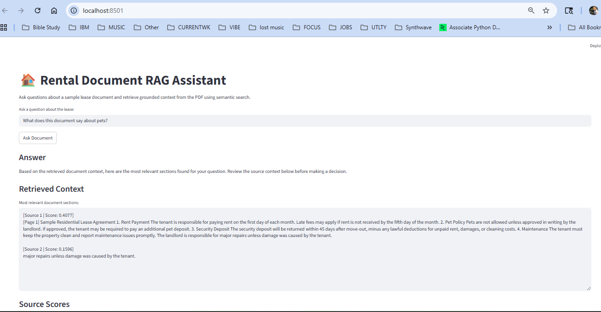
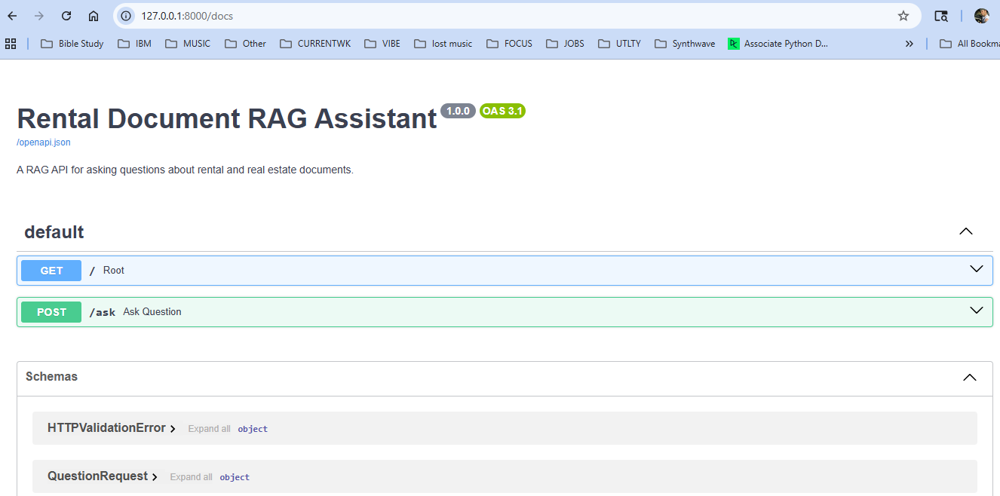

# Real Estate / Rental Document RAG Assistant

A production-style Retrieval-Augmented Generation (RAG) assistant that allows users to ask questions about real estate and rental documents, such as leases, inspection notes, rental agreements, and property paperwork.

The system loads PDF documents, extracts text, splits the content into searchable chunks, stores those chunks in a FAISS vector database, retrieves the most relevant sections, and returns document-grounded answers with supporting context.

---

## Project Purpose

Real estate and rental documents are often long, dense, and difficult to quickly understand. This project demonstrates how machine learning, semantic search, and backend API design can be combined to help users ask natural-language questions and receive answers based on the actual document content.

Example questions:

```text
What does the lease say about pets?
Who is responsible for repairs?
When is rent due?
What are the tenant responsibilities?
```

---

## Screenshots

### Streamlit Dashboard



### FastAPI Documentation



---

## Features

- PDF document loading and text extraction
- Text chunking for long document processing
- Semantic search using FAISS vector storage
- Sentence Transformers embeddings for document retrieval
- RAG answer engine with supporting context
- Runnable demo pipeline
- FastAPI `/ask` endpoint for backend question answering
- Streamlit dashboard for interactive document Q&A
- Docker Compose support for API and dashboard deployment
- Environment variable template with `.env.example`
- Automated Pytest test suite
- Clean project structure suitable for portfolio and production-style expansion

---

## Production-Style Features

- FastAPI backend for document question answering
- Streamlit dashboard for interactive user testing
- FAISS vector search for semantic document retrieval
- Sentence Transformers embeddings for semantic similarity
- PDF/text document processing
- Modular RAG pipeline structure
- Docker Compose support for running the API and dashboard together
- CPU-based PyTorch configuration for local Docker compatibility
- Automated pytest test suite
- Sample lease document for safe public demonstration
- Environment variable template with `.env.example`

---

## Tech Stack

- Python
- FastAPI
- Streamlit
- FAISS
- Sentence Transformers
- PyTorch CPU
- Pydantic
- Pytest
- Docker
- Docker Compose

---

## Project Structure

```text
rental-document-rag-assistant/
├── app/
│   ├── __init__.py
│   ├── demo_rag.py
│   └── main.py
├── dashboard/
│   └── streamlit_app.py
├── data/
├── notebooks/
├── scripts/
│   └── __init__.py
├── screenshots/
├── src/
├── tests/
├── .dockerignore
├── .env.example
├── docker-compose.yml
├── Dockerfile
├── README.md
└── requirements.txt
```

---

## Run with Docker

Build and start both the FastAPI backend and Streamlit dashboard:

```bash
docker compose up --build
```

FastAPI documentation:

```text
http://localhost:8000/docs
```

Streamlit dashboard:

```text
http://localhost:8501
```

Run in detached mode:

```bash
docker compose up -d
```

Check running containers:

```bash
docker compose ps
```

Stop the containers:

```bash
docker compose down
```

> Note: The Docker build uses CPU-based PyTorch so the project can run locally without requiring a GPU or CUDA setup.

---

## Run the Streamlit Dashboard Locally

Start the interactive dashboard:

```bash
python -m streamlit run dashboard/streamlit_app.py --server.fileWatcherType none
```

Then open:

```text
http://localhost:8501
```

The dashboard allows users to type a document question and receive an answer with supporting context.

---

## Run the FastAPI App Locally

Start the FastAPI backend:

```bash
python -m uvicorn app.main:app --reload
```

Then open the interactive API docs:

```text
http://127.0.0.1:8000/docs
```

Example request body:

```json
{
  "question": "What does the lease say about pets?"
}
```

---

## Run Tests

Run the full test suite:

```bash
python -m pytest
```

Current test result:

```text
16 passed
```

---

## Example Use Case

A user processes a rental or real estate document and asks:

```text
What does the lease say about pets?
```

The system retrieves the most relevant document chunks and returns an answer grounded in the document text.

---

## Portfolio Highlights

This project demonstrates:

- End-to-end machine learning application design
- Semantic search and vector database usage
- Retrieval-Augmented Generation pipeline architecture
- API development with FastAPI
- Interactive dashboard development with Streamlit
- Dockerized local deployment workflow
- Automated testing with Pytest
- Clean Git/GitHub workflow
- Production-style project organization

---

## Responsible AI Note

This assistant is designed to help users search and summarize document content. It does not provide legal advice, financial advice, or professional real estate guidance. Users should verify important lease, rental, or property decisions with a qualified professional.

---

## Future Improvements

Potential future upgrades include:

- Multi-document upload support
- User authentication
- Better source citations by page number
- Cloud deployment
- UI file uploader
- Chat history
- Model evaluation metrics for answer quality
- Document comparison across multiple leases or agreements